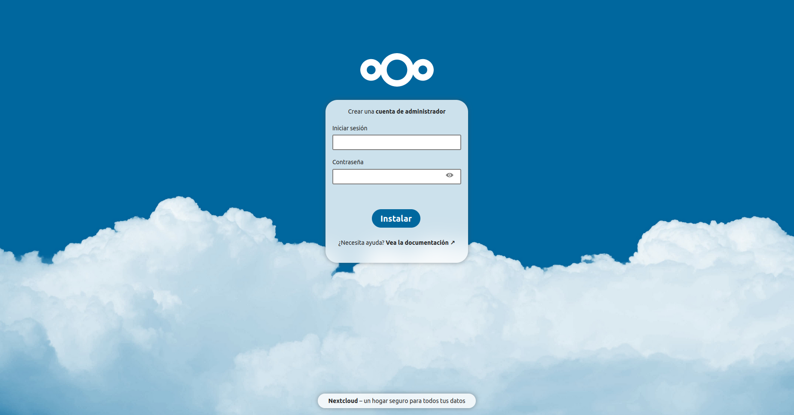

# 3. Eguneko ariketa: Ansible erabiliz Docker zerbitzu bat era automatizatuan altxatu

> [!IMPORTANT]
> Lan-eremua prestatzeko, pauso hauek jarraitzea gomendatzen da: 1) .pem fitxategia proiektuko karpetara kopiatu, 2) hosts fitxategian makina birtualaren IP helbidea idatzi, 3) terminalean, ```. setup.sh``` komandoa exekutatu

Ariketa honetan, Ansible eta Docker erabiliz Nextcloud bat altxatzea eskatzen da.

Nextcloud zerbitzua martxan jartzeko oharrak:

- Web interfazea 80 portuan altxatzen da, beraz, AWS Academy-ko makina birtualeko segurtasun erregeletan 80 portua ireki beharko litzateke.
- Nextcloud-ek datu base bat behar du, beraz, MySQL container bat altxatzea ere beharrezkoa izango da.

Playbook-ean idatzi beharreko pausoak:

- Docker engine-a instalatu (root erabiltzailearekin). [Dokumentazio ofizialeko pausoak](https://docs.docker.com/engine/install/ubuntu/#install-using-the-repository) jarraitu daitezke.
- (Hautazkoa) 'ubuntu' erabiltzailea 'docker' taldean sartu. Ez da beharrezkoa eta dena 'root' erabiltzailearekin egin daiteke.
- Bi container-ak (MySQL eta Nextcloud) lotuko dituen Docker sare bat sortu: [laguntza](https://docs.ansible.com/ansible/2.9/modules/docker_network_module.html).
- MySQL eta Nextcloud container-ak altxatu: [laguntza](https://docs.ansible.com/ansible/2.9/modules/docker_container_module.html#examples). Parametro bakoitzaren dokumentazioa ondo irakurri behar da, ez da compose.yml sintaxiaren berdina. 'compose.yml' fitxategi bat kopiatzea eta altxatzea beste aukera bat da, noski: [laguntza](https://docs.ansible.com/ansible/latest/collections/community/docker/docker_compose_v2_module.html#ansible-collections-community-docker-docker-compose-v2-module).
- "http://\<makina-birtualaren-helbidea>" URL-a nabigatzaile batean ireki eta Nextcloud web interfazea ikusi beharko litzateke: 